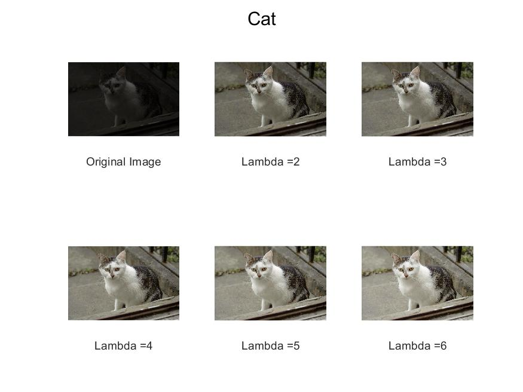
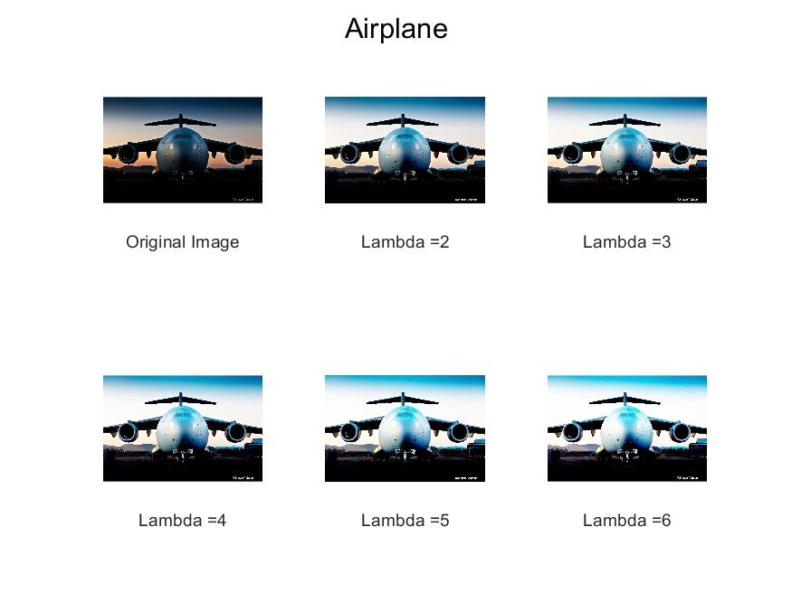
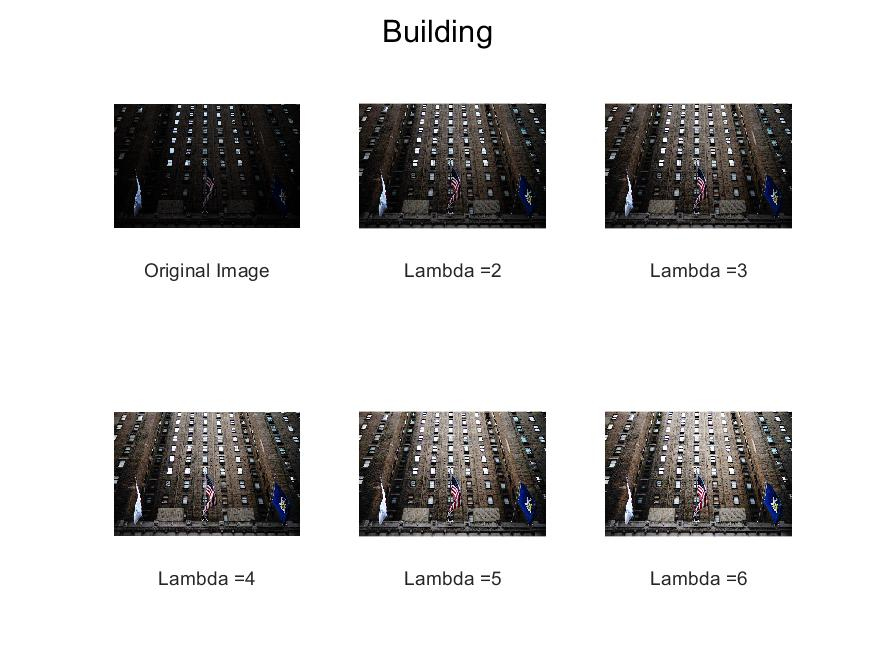
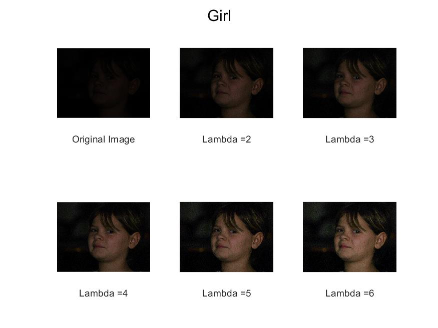
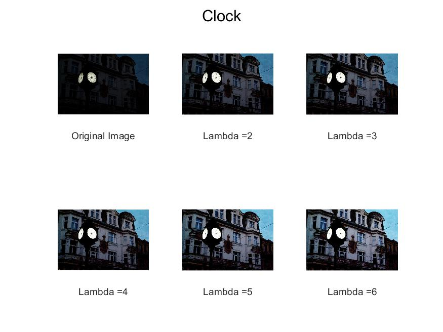
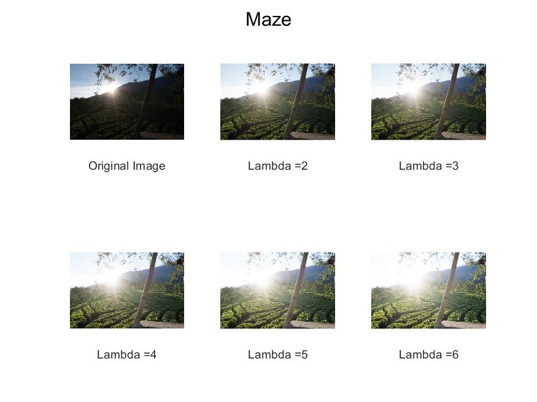

# Nighttime image enhancement using a new illumination boost algorithm
Repository which replicates the results obtained by Al-Ameen, Zohair in his paper entitled  _[Nighttime image enhancement using a new illumination boost algorithm](https://ieeexplore.ieee.org/document/8741330)_, published at [IET Image Processing Journal](https://digital-library.theiet.org/content/journals/iet-ipr).

The code was implemented using MATLAB, following the steps presented in the paper.

## Usage
The [`illumination_boost.m`](./illumination_boost.m) file contains the main (and only) function for the algorithm. It accepts an RGB image, and a Lambda parameter used in equations `4` and `6` in the paper, which, according to the paper, acquire best results with values between 2 and 7. It returns an RGB image with `double` type.

A test file named [`test_illumination_boost.m`](./test_illumination_boost.m) is made available, to test the function with the images available in the [`input_images`](./input_images/) folder, varying the lambda parameter from 2 to 6.

## Results
Several results are available in the [`output_images`](./output_images/) folder, and some of them are displayed below:

## Disclaimer
This repository is not endorssed and/or affiliated in any way to Al-Ameen, Zohair. The paper was replicated for purely didactic purposes.